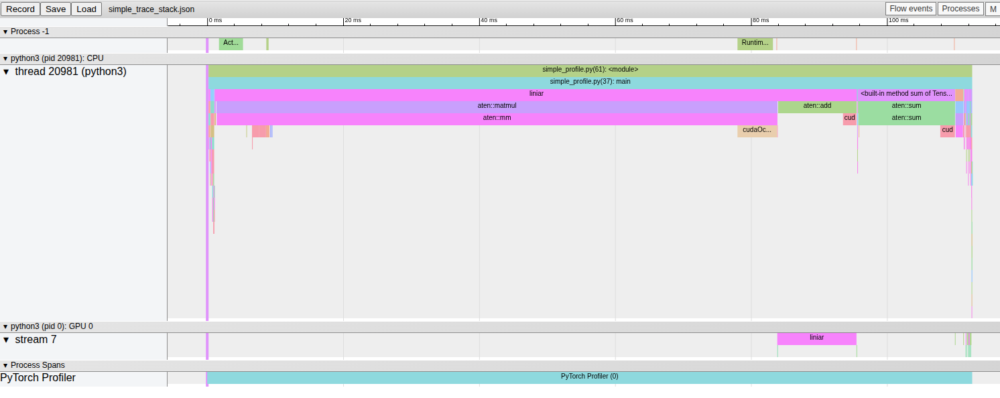
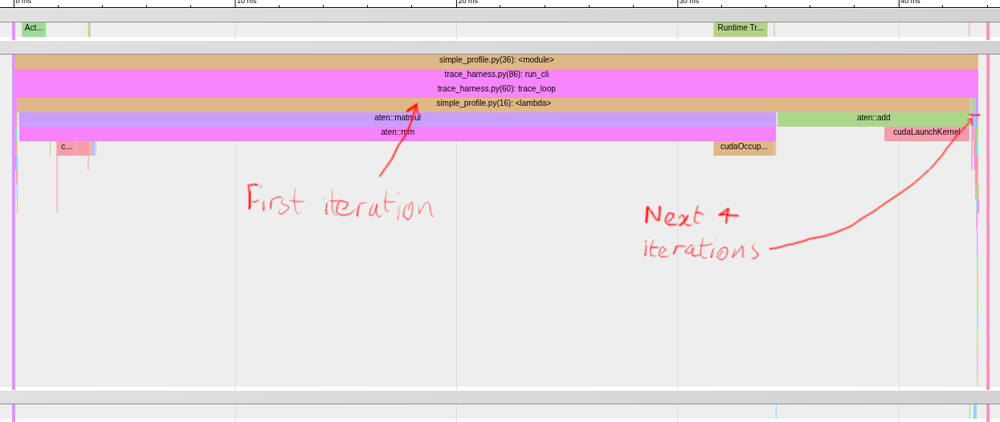
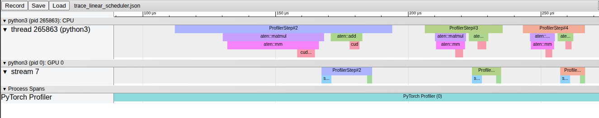
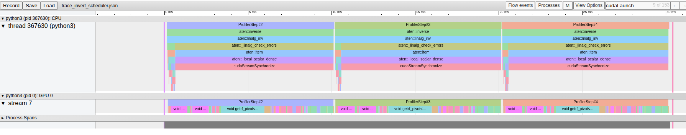
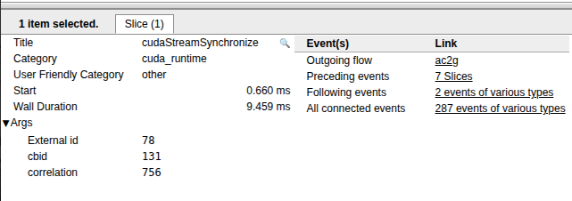
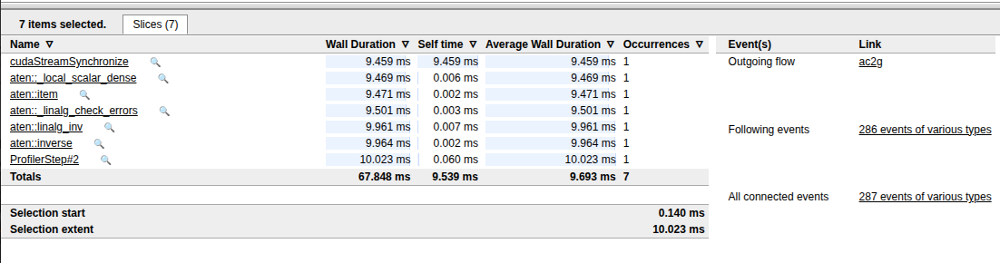
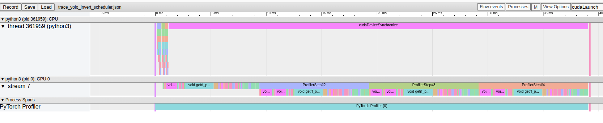

# Using the Pytorch profiler


Pytorch comes with a built in profiling tool that can produce traces which help
with diagnosing runtime performance issues and allow you to reduce the amount
of time it takes to train your models. The Pytorch document provides a great
tutorial on how to set up the profiler and produce a trace, but unfortunately
it doesn't really tell you how to use this trace once you have produced it.
There are a few other tutorials out there, including videos on youtube, but
in my opinion, I think they tend to jump straight to diagnosing and fixing
a problem and don't really explain what the trace file is showing and how to
read it.

## Generating a trace file and navigating the graph in Chrome

Let's start by looking at a trace generated by [simple_profile.py](simple_profile.py)
This script just does a simple `z = W * x + B` five times and sums
up the values in `z`. The actual code that does this is (approximately)
as follows:

```python
activities = [ProfilerActivity.CPU, ProfilerActivity.CUDA]
with profile(activities=activities, with_stack=True) as prof:
    for _ in range(5):
        with record_function("linear"):
            z = weights @ x + bias
        total += z.sum().item()
        prof.step()
prof.export_chrome_trace("simple_trace_with_stack.json")

```

For a full explanation of how the profiling instrumentation works, you
should check out the tutorial [here](https://docs.pytorch.org/tutorials/recipes/recipes/profiler_recipe.html),
but basically this is going to set up the profiler to record all CPU and
CUDA activity during the loop, and it is going to record the full stack trace.
In addition, it uses the `record_function` context manager to annotate
the section where `z` is calculated.

Once the loop is finished, the trace is saved to a file which can be opened
with Google Chrome. To do this, open up the browser and enter `chrome://tracing`
into the address bar. This will bring you to a screen where you can load the
file by clicking on the `load` button. You should see something like this:



The easiest way to navigate this graph is to use the `wsad` keys, which behave
just like a video game

* `w` - zoom in
* `s` - zoom out
* `a` - scroll left
* `d` - scroll right

If you zoom in with `w` and scroll left with `a`, you can see where the profiler
actually initialises.


This shows a flame graph of the stack while the profiler is being initialised.
You can see how the context manager's  `__enter__` method gets called and this
in turn calls the `start` function defined in `torch/profiler/profiler.py`. By
default the profiler doesn't record the full stack trace as a lot of this info
could be considered noise, but it is interesting to see here how the
initialisation process runs and note that it is not instant.

The next big section of the graph is dominated by a matrix multiplication
followed by an addition operation. This takes about 50ms (which is almost the
entire program runtime). You can see that most of the time is spent on the CPU
making calls to functions like
`cudaOccupancyMaxActiveBlocksPerMultiprocessorWithFlags` before the ops finally
call `cudaLaunchKernel` and give the GPU a few nanoseconds of work.

Zooming right in on the right hand side of the graph, we can see that the
subsequent iterations run much quicker. This time the CPU almost immediately
dispatches the work to the GPU.



### Trimming down the graph using a scheduler

This warm-up period means that typically you do not want to profile the first
loop, and the Pytorch profiler gives you a scheduler tool for managing this. The
following code will get the profiler to wait one step before starting, then once
it has started, it will wait another step before recording anything. This will
chop out the initial iteration where Pytorch is gathering the info needed to
launch kernels and then it will avoid recording the next iteration which could
be affected by the time that the profiler uses starting up. The call to
`prof.step()` lets the scheduler know what the current iteration is.

```python

activities = [ProfilerActivity.CPU, ProfilerActivity.CUDA]
scheduler = schedule(wait=1, warmup=1, active=3)
with profile(activities=activities, schedule=scheduler) as prof:
    for _ in range(5):
        z = weights @ xs + bias
        prof.step()
```

Using this code produces the following graph on my laptop:



This is way more legible than the original graph and I don't need to to a lot of
zooming and scrolling to see what is going on.

## Inspecting interactions between the CPU and GPU

The CPU and GPU operate independently and communicate with each other
by sending signals. In order to launch a kernel the CPU calls
`cudaLaunchKernel` this request is put on a queue called and will run
asynchronously. In order for the CPU to know when the kernel has completed
it will need to wait for a synch event. These synch events are automatically
managed by PyTorch and the details of this are beyond the scope of this
article, but you can find when the CPU is waiting on a synch event by
searching for calls to `cudaStreamSynchronize`.

In order to demonstrate this, let's look at how the PyTorch matrix inversion
operation works. Unlike addition and multiplication, this one operation
requires launching multiple kernels and several of these kernels are
relatively long running compared to the previous operations.

The following trace was generated with code similar to the following:

```python
xs = torch.random((1000, 1000), device=gpu)
activities = [ProfilerActivity.CPU, ProfilerActivity.CUDA]
scheduler = schedule(wait=1, warmup=1, active=3)
with profile(activities=activities, schedule=scheduler) as prof:
    for _ in range(5):
        xs.invert() 
        prof.step()
```

This produces the following trace on my computer:



The first thing to note about this trace is that unlike the previous traces,
the GPU is busy for almost the entire time - there are very few blank gaps
in the swim-lane for `Stream 7` (which is a CUDA stream). Looking at the
CPU thread, we can see that the iterations are dominated by a long
call to `cudaStreamSynchronize`. To see what it causing this, you can
first click on the `cudaStreamSynchronize` block to see the details for that
function call, then click on the `Preceeding Events` link to see the call
stack





It looks like `aten::_linalg_check_errors` is causing the CPU to wait until
the matrix inversion is finished so that the result can be checked. Searching
through the PyTorch documentation, it looks like there is a version of
the matrix inversion operation which does not check for errors. Let's live
a little dangerously and see what happens if we run that instead.



The most striking thing about this trace is that the CPU iterations complete
in less than a millisecond, with the GPU lagging way behind. There is no
visual alignment between the CPU events and the GPU events. If you want to find
the CPU event that initiated a specific GPU event. Click on the GPU event
to bring up the event info box and then mouse-over/click the
`Incoming Flow ac2g` link. This will show an arrow linking the CPU and GPU
events.


The second thing to note is that removing the correctness check didn't make
the program complete any quicker. All that happened was that the Python
loop finished quickly and then the CPU was left stuck in a call to
`cudaStreamSynchronize`. In theory though, we could have had the CPU
do something else while this was happening, and this is one of the main ways
you can optimise the throughput of a PyTorch program. In the next section
I will look at a more realistic use case to show how this type of optimisation
can work.
