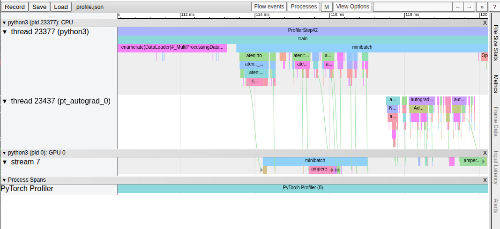
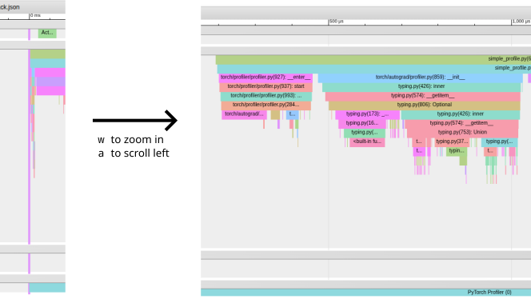

# Using the Pytorch profiler



Pytorch comes with a built in profiling tool that can produce traces which help
with diagnosing runtime performance issues and allow you to reduce the amount
of time it takes to train your models. The Pytorch document provides a great
tutorial on how to set up the profiler and produce a trace, but unfortunately
it doesn't really tell you how to use this trace once you have produced it.
There are a few other tutorials out there, including videos on youtube, but
in my opinion, I think they tend to jump straight to diagnosing and fixing
a problem and don't really explain what the trace file is showing and how to
read it.

## Tracing a simple Pytorch program

Let's start by looking at a trace generated by [simple_profile.py](simple_profile.py)
This script just does a simple `z = W * x + B` five times and sums
up the values in `z`. The actual code that does this is (approximately)
as follows:

```python
activities = [ProfilerActivity.CPU, ProfilerActivity.CUDA]
with profile(activities=activities, with_stack=True) as prof:
    for _ in range(5):
        with record_function("linear"):
            z = weights @ x + bias
        total += z.sum().item()
        prof.step()
prof.export_chrome_trace("simple_trace_with_stack.json")

```

For a full explanation of how the profiling instrumentation works, you
should check out the tutorial [here](https://docs.pytorch.org/tutorials/recipes/recipes/profiler_recipe.html),
but basically this is going to set up the profiler to record all CPU and
CUDA activity during the loop, and it is going to record the full stack trace.
In addition, it uses the `record_function` context manager to annotate
the section where `z` is calculated.

Once the loop is finished, the trace is saved to a file which can be opened
with Google Chrome. To do this, open up the browser and enter `chrome://tracing`
into the address bar. This will bring you to a screen where you can load the
file by clicking on the `load` button. You should see something like this:


The easiest way to navigate this graph is to use the `wsad` keys, which behave
just like a video game

* `w` - zoom in
* `s` - zoom out
* `a` - scroll left
* `d` - scroll right

If you zoom in with `w` and scroll left with `a`, you can see where the profiler
actually initialises.


